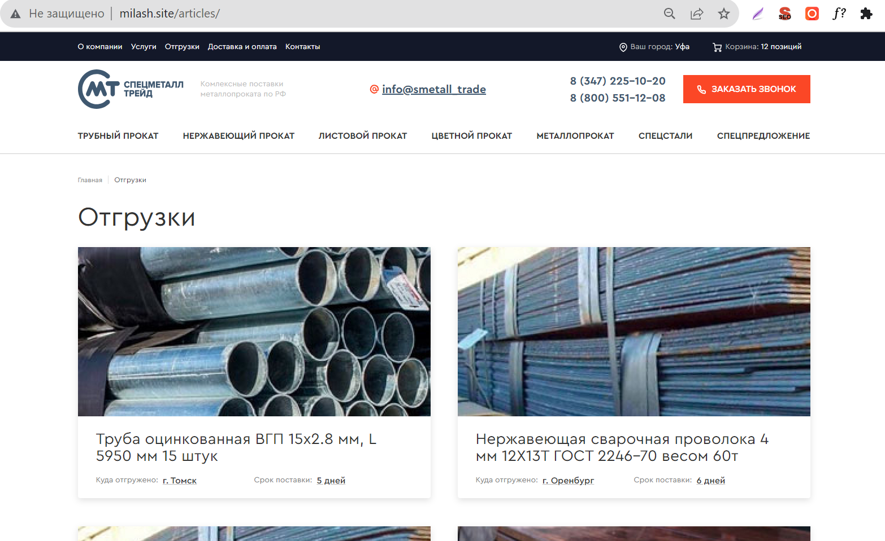

# Shipment Layout on 1C-Bitrix

---
Руководство по развёртыванию

---
1. Структура проекта
    - **dist** - финальная папка проекта заливать в корень сайта на Битриксе
    - **src** - файлы источников
2. Техническое задание
- Зарегистрировать аккаунт на любом хостинг-провайдере, у которого есть бесплатный пробный период.

- Развернуть CMS-систему 1С-Bitrix на созданном хостинг-аккаунте (любая версия PHP 7.4).

- Сверстать внутреннюю страницу “Отгрузки” по макету в Фигме во вложении, используя фреймворк Bootstrap 5. Остальные фреймворки если требуются (желательно минимизировать использование сторонних библиотек, в этом задании можно обойтись одним Bootstrap 5 и jQuery) - по желанию. Вёрстка должна быть адаптивной и хорошо смотреться на ширине экранов 320-767, 768-991, 992-1199, 1200+. Также вёрстка должна быть кроссбраузерной и адекватно смотреться на таких браузерах как Google Chrome, Mozilla Firefox, Safari.

- Созданную вёрстку посадить на Bitrix, используя стандартный компонент bitrix:news, либо создав свой собственный. Создать страницу отгрузок в админке системы, вывести их на странице по пути /articles/.

- Сделать так, чтобы каждый логотип при наведении становился цветным.

- После выполнения задания прислать ссылку для оценки выполненного задания.

Шаблон  
https://www.figma.com/file/qH55X4VtPWjvE3a4kzzZFw/%D0%A2%D0%97-%D0%9F%D1%80%D0%BE%D0%B3%D1%80%D0%B0%D0%BC%D0%BC%D0%B8%D1%81%D1%82%D1%83?type=design&node-id=226%3A22007&mode=design&t=Qs2bTMRmAtysYUjP-1
